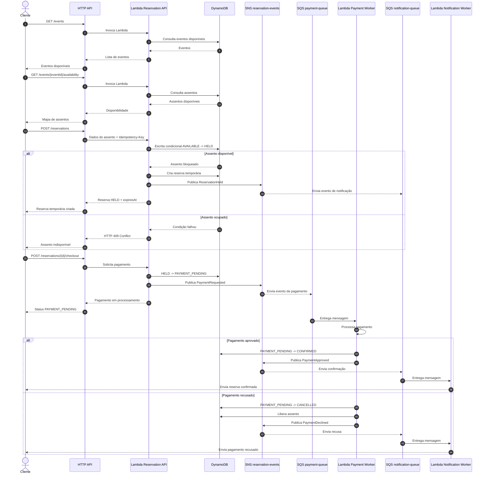

# Sistema de Reservas para Eventos de Alta Demanda

## Objetivo

Construir uma aplicação serverless para reservar ingressos ou assentos em eventos de alta demanda, evitando reservas duplicadas e suportando milhares de tentativas concorrentes.

O sistema controla reservas temporárias, processa pagamentos de forma assíncrona, libera reservas expiradas e envia notificações ao cliente sobre cada mudança de estado.

## Características principais

- Reserva atômica de assentos ou ingressos.
- Bloqueio temporário antes do pagamento.
- Prevenção de overbooking.
- Processamento assíncrono de pagamentos e notificações.
- Retry automático de mensagens com SQS.
- DLQ dedicada para cada fila de processamento.
- Idempotência nas APIs e consumidores.
- Rastreamento de reservas, pagamentos e eventos.
- Infraestrutura como código com Terraform.
- Implementação compatível com o AWS Free Tier sempre que possível.

## Stack

- Python.
- FastAPI e Mangum.
- Pydantic.
- uv para gerenciamento e lock das dependências.
- Boto3.
- AWS Lambda Powertools.
- Amazon API Gateway HTTP API.
- Amazon DynamoDB com Single Table Design.
- Amazon SNS.
- Amazon SQS e Dead Letter Queues.
- Terraform.
- GitHub Actions com Gitflow.

## Arquitetura resumida

```text
Cliente
  -> API Gateway HTTP API
  -> Lambda Reservation API
  -> DynamoDB
  -> SNS reservation-events
       -> SQS payment-queue       -> Lambda Payment Worker
       -> SQS expiration-queue    -> Lambda Expiration Worker
       -> SQS notification-queue  -> Lambda Notification Worker
       -> SQS analytics-queue     -> Lambda Analytics Worker
```

O cliente recebe respostas síncronas apenas para operações da API. Processos como pagamento, expiração, notificações e métricas são executados de forma assíncrona.

## Fluxo comum do cliente

O fluxo abaixo representa a jornada normal de um cliente: consultar eventos, escolher um assento, criar uma reserva temporária, realizar o checkout e receber a confirmação.



## Expiração da reserva

Se o cliente não concluir o pagamento dentro do prazo, o worker de expiração verifica a reserva e executa:

```text
HELD -> EXPIRED
assento reservado -> AVAILABLE
```

A operação deve ser condicional para não expirar uma reserva que já tenha sido confirmada ou cancelada.

## Estados da reserva

```text
AVAILABLE
    -> HELD
    -> PAYMENT_PENDING
    -> CONFIRMED

HELD
    -> EXPIRED
    -> CANCELLED

PAYMENT_PENDING
    -> CONFIRMED
    -> CANCELLED
```

## Princípios técnicos

- Usar escrita condicional no DynamoDB para impedir reserva duplicada.
- Usar `TransactWriteItems` quando a operação precisar atualizar itens relacionados atomicamente.
- Usar idempotência para requisições repetidas e mensagens duplicadas.
- Não depender de ordenação global de mensagens; o estado deve ser validado no DynamoDB.
- Configurar DLQ para todas as filas SQS.
- Usar partial batch response nos consumidores Lambda.
- Manter regras de negócio fora do FastAPI e do Boto3.
- Usar Terraform para criar e alterar os recursos AWS.

## Estrutura do projeto

```text
reservation_service/   # Código da aplicação Python
tests/                 # Testes unitários, integração e contrato
infra/                 # Terraform, ambientes e módulos
.github/workflows/     # CI, plan, deploy e destroy
pyproject.toml         # Metadados e dependências do projeto
uv.lock               # Resolução reproduzível das dependências
PLAN.md               # Requisitos e decisões do projeto
README.md             # Visão geral e documentação inicial
```

## Segurança operacional

O workflow de destruição será exclusivamente manual, exigirá aprovação do environment `dev-destroy` e destruirá somente os recursos presentes no Terraform state do ambiente selecionado.
